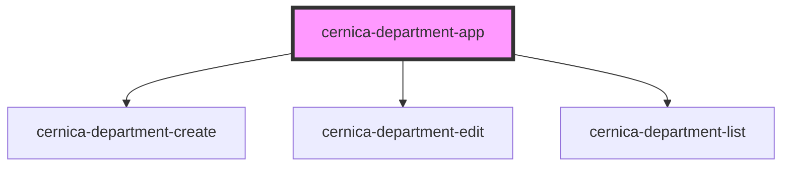

# cernica-department-app

<!-- Auto Generated Below -->

## Properties

| Property   | Attribute   | Description | Type     | Default |
| ---------- | ----------- | ----------- | -------- | ------- |
| `apiBase`  | `api-base`  |             | `string` | `""`    |
| `basePath` | `base-path` |             | `string` | `""`    |

## Dependencies

### Depends on

- [cernica-department-create](../cernica-department-create)
- [cernica-department-edit](../cernica-department-edit)
- [cernica-department-list](../cernica-department-list)

### Graph

----------------------------------------------

*Built with [StencilJS](https://stenciljs.com/)*
